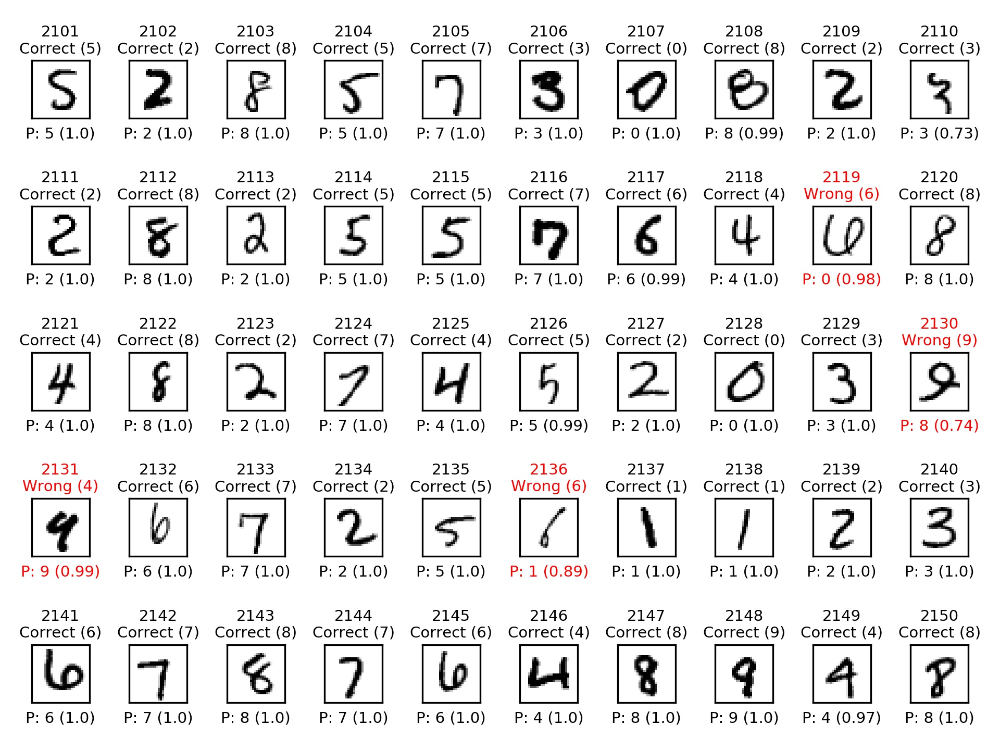

# MNIST-Visualizer
A python script that allows you to see what digits your model guessed wrong by creating a video.  
The frames/plots that contain a wrong predicted digit will be 2s long the ones that do not are 1/15 * s.  
I have also provided my model and the script I used to train it.  

The **P** stands for Predicted;

## What can you see?
1. Was the prediction correct or was it wrong
2. After correct/wrong will display the correct answer
3. Will display the prediction it made and how certain it was

## Prerequisites
tensorflow, numpy, opencv, matplotlib
## How to use
1. Save your trained model for mnist digit recognition
2. use the mnist-visualizer.py script

path_to_model: path to the model.h5 file  
save_temp_figs: **0** to delete the temporary jpgs made by the script; **1** to keep them

```
python mnist-visualizer.py model.h5 1
```
[](https://youtu.be/JQwfH9-0BTw)
